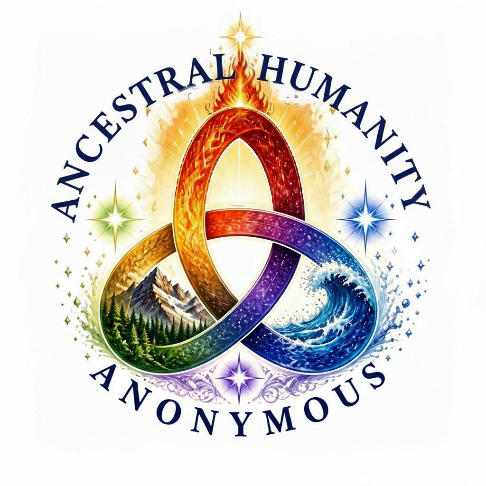
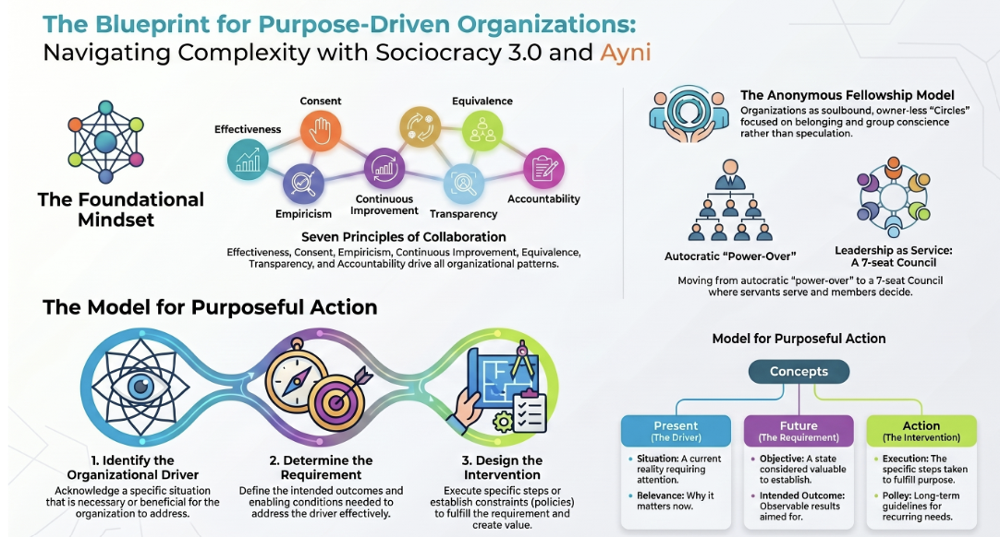
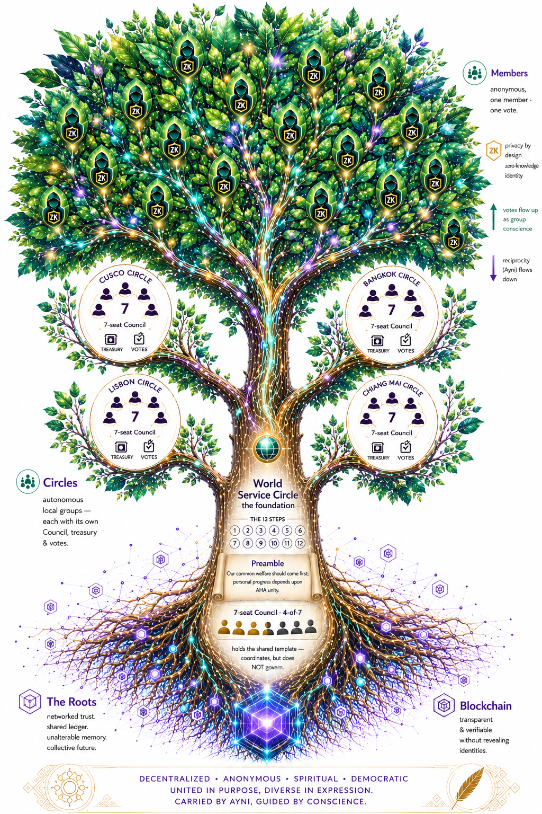

<!-- Machine-assisted translation — please review with a native Quechua speaker before trusting. -->
<div align="center">



# Ayni

**Kikin-kamachikuq, mana riqsisqa yanapanakuy huñukuna Solana patapi — soulbound, ZK-pakasqa, mana kapuyniyuq.**

Yanapanakuy huñukuna DAO-kunapaq kicharisqa pirwa, mana riqsisqa akllaywan (zero-knowledge) hinaspa akllasqa willay yawar-mast'a credencialkunawan.

[](../LICENSE)
[](https://www.anchor-lang.com/)
[](https://solana.com/)
[](https://docs.circom.io/)
[](../BACKLOG.md)
[](#-yanapay)

🌍 [Other languages](README.md) · [English](../README.md)

</div>

---

## ¿Imataq Ayni?

Ayni nisqaqa **mana riqsisqa Decentralised Autonomous Organisation (DAO)** nisqaq Solana ruwaynin —
ñawpaqtaqa **AHA (Ancestral Humanity Anonymous)** nisqaq munaynin huntanapaq kamarisqa karqan, ichaqa
ima huñumampas kicharisqam. Sutinpiqa, kay pacha tukuypi yanapanakuy huñukunapaq mana mayqin chain-niyuq
plantillam, **AA / 12-step willakuykunaq** pachak watapi qhawachisqa atipayninpi rurasqa. Mayqin huñumanpas
kamarisqa ñantam quchkan: **runakunata chaskinapaq, qullqi waqaychanata hapinapaq, huñu-sunquwan tantiynapaq,
hinaspa chinkasqa llawikunamanta hatariy** — sapa runaqa **ñawpaqmanta mana riqsisqa** kachkan
zero-knowledge akllaykunawan.

- **Imatam ruran** — chain patapi yanapanakuy huñutam puririchin: watan watan soulbound chaskikuykuna,
  mana riqsisqa huk-runa-huk-akllay, qaraykuy-lla qullqi waqaychana, hinaspa 7-tiyana Council 4-de-7
  llawi hatariywan — mana kapuyniyuq, mana admin llawiyuq.
- **Pimpaqmi** — yanapanakuy huñukuna, ayni-yanapay huñukuna, mana riqsisqa ayllukuna, *kaynin* munaq
  DAO-kuna manataq especulación munaqkuna, hinaspa pipas **chiqap pakayta** muñaq runanpaq.
- **Imayna llamk'achina** — plantillata fork-ay, huk Council-ta tiyaykachiy, huk Circle-ta kichay,
  hinaspa runakuna pakasqa commitment hina chaskikunku. Qhaway [Utqay qallariy](#-utqay-qallariy).

> *Ayni* (Runa Simi): quykuy chaskikuypa willka kutichinakuynin — kikin-yanapay, huk runa huk
> kunkalla, mana chawpi kapuyniyuq.

---

## ✨ Imaymanakuna

- 🪪 **Soulbound chaskikuy** — watan watan, mana qunakuy atiy. Kayninqa llamk'aspa hinaspa musuqchaspa
  ganasqam, mana rantisqa nitaq qhatusqa.
- 🕶️ **Ñawpaqmanta mana riqsisqa** — huk runaqa Merkle huñupi pakasqa commitment-mi, mana qhawasqa
  wallet-chu. Akllaypas credencialpas zero-knowledge-mi; riqsiyqa akllaspallam rikurin.
- 🗳️ **Huñu-sunqu akllay** — huk runa, huk akllay, mana riqsisqalla churasqa (mana token-llasaqniyuq
  plutocracia), sapa propuestapi nullifier iskay-kutichakuyta hark'aspa.
- 🏛️ **Mana kapuyniyuq, mana admin llawiyuq** — 7-tiyana Council-mi *kamachiq kachkan* hinaspa
  **4-de-7**-llawan ruwan.
- 🔑 **Chinkayta atipaq llawi hatariy** — huk tiyanata muyuchiy utaq chinkasqa wallet-pa tukuy
  imanninta musuqman astay, sapa cheqaq tiyana kichariy atiq atipay-pacha qhipapi.
- 🌱 **Fork-ay atiq Circle-kuna** — mayqin huñupas musuq Circle-ta paqarichin kikin kamachiywan;
  World Service Circle-qa kuska kaqkunata wakichin, mana kamachinchu.
- 📜 **Akllasqa willay credencialkuna** — yachachiy/qallariy certificadokuna ("pi, ima yachachiy,
  piwan yachachisqa, hayk'aq") *huk-niray huk-niray* zero-knowledge-pi kicharisqa.

---

## 💡 Imaynam huñunakun

Sach'a hina ñawiriy — runakunaqa hanaqpi raphi-pacham, Circle-kunaqa k'allmakunam, hinaspa World
Service Circle-qa sapi-kurkum uraypi:

```
 member member member      member member member      member member member     ← the members
 (anon) (anon) (anon)      (anon) (anon) (anon)      (anon) (anon) (anon)         (anonymous,
    \      |      /          \      |      /          \      |      /              one member,
     ┌─────┬─────┐            ┌─────┬─────┐            ┌─────┬─────┐               one vote)
     │   Cusco   │            │  Lisbon   │            │  Bangkok  │
     │ Council 7 │            │ Council 7 │            │ Council 7 │   …        ← Circles: the
     └─────┴─────┘            └─────┴─────┘            └─────┴─────┘               branches
           └────────────────────────┬────────────────────────┘
                                    │   every Circle is forked from one shared template
                     ┌───────────────┴───────────────┐
                     │     WORLD SERVICE CIRCLE       │   ← the trunk / root ("foundation"):
                     │   12 Steps · Preamble · docs   │      holds the shared template + a
                     │    7-seat Council · 4-of-7     │      Council (4/7) that coordinates
                     └───────────────────────────────┘      but does NOT govern
```

- **Runakuna (raphi-pacha)** — sapankaqa huk Circle-pa runa huñunman pakasqa commitment hina yaykun
  hinaspa akllaykunawan ruwan; mana hayk'appas wallet-ta rikuchinanchu. Huk runa, huk akllay.
- **Circle-kuna (k'allmakuna)** — kikin kamachiq llaqta huñukuna, sapankaq kikin 7-tiyana Council-niyuq,
  qullqi waqaychananiyuq, akllaynniyuq; plantillamanta fork-asqa.
- **World Service Circle (sapi-kurku)** — kuska plantillata hinaspa documentokunata hapin hinaspa Circle
  paqarichiyta wakichin, ichaqa llaqta huñu-sunquta **mana** atipanchu. Kay tinkiyqa *federación tinkiy*,
  manam kamachiy chayna.

## 🎩 Pim imata ruran — 7-tiyana Council

```
                          THE COUNCIL  (7 seats · acts by 4-of-7 · IS the authority)
   ┌──────────────────────── 3 functional servants ────────────────────────┐
   │                                                                        │
   │   TREASURER          SECRETARY            RHYTHM KEEPER                 │
   │   stewards the       admits members,      keeps the cadence of         │
   │   treasury &         records & docs,      meetings/ceremonies;         │
   │   soulbound mint     proposal hygiene     the reference / lead seat    │
   │                                                                        │
   └────────────────────────────────────────────────────────────────────────┘
   ┌──────────────────────── 4 elders of the directions ───────────────────┐
   │                                                                        │
   │   ELDER NORTH      ELDER EAST       ELDER SOUTH       ELDER WEST        │
   │   no daily duty — their role is quorum & resilience, so recovery       │
   │   never depends on the three busy servants alone (medicine wheel)      │
   │                                                                        │
   └────────────────────────────────────────────────────────────────────────┘

   MEMBERS  ──one-member-one-vote (anonymous, ZK)──▶  group-conscience decisions
            the Council serves and recovers; the membership decides direction
```

- **Mana admin llawiyuq.** Sapa atiyniyuq ruwayqa huk Council tiyanaq llamk'aynin utaq huk 4-de-7
  propuesta.
- **Yanapaqkuna yanapanku, runakuna tantianku.** Sapa p'unchaw llamk'aykunaqa huk tiyanaman quykusqa
  hinaspa Council muyuywan qichuy atiy; ñanqa runakunaq akllayninwanmi churasqa.

---

## 📖 Llamk'achiy & qhawarichiykuna

Tawa hina tantiy laya Ayni-q yanapasqan, hinaspa maypi sapanka tiyan:

| Tantiy | Pi akllan | Ruway niray |
|---|---|---|
| **Llaqta kaq** (huk Circle-pa kikin ruwaynin) | chay Circle-pa runankuna | mana riqsisqa ZK runa akllay |
| **Foundation charter** (qhaway "12 Steps") | foundation-llaq llawinkuna | World Service runa/Council akllay |
| **Kuska qillqa** (qhaway nisqa Preamble) | **tukuy** Circle-kuna + foundation | federación-tukuy huñusqa akllay |
| **Hatariy / qullqi waqaychana** | 7-tiyana Council | 4-de-7 propuesta + atipay-pacha |

Tukuy kaykunaq ruwasqa, copy-pasteable willanchikunaqa kaypim **[IMPLEMENTATION.md](../IMPLEMENTATION.md)**.

<div align="center">
  
</div>

---

## 🚀 Utqay qallariy

> Ñawpaq munasqakuna: **Rust**, **Solana/Agave CLI 2.x**, **Anchor 0.31.1**, **Node 20+**, hinaspa
> (akllaykunapaq) **circom 2.1** + **snarkjs**.

```bash
# 1. clone
git clone https://github.com/Ayniator/Ayni.git && cd Ayni

# 2. install JS deps (proving helpers + tests)
npm install

# 3. build the on-chain program
anchor build

# 4. run the test suite (localnet: memberships, 4-of-7 recovery, a real ZK vote round-trip)
anchor test
```

Chaymi ñawpaq kaq tukuy kuti. Test-kunaqa huk Circle-ta sayachin, mana riqsisqa chaskikuykunata quykun,
huk 4-de-7 hatariyta puririchin, hinaspa chiqap Groth16 akllay akllayta chain patapi qhawachin
(hinaspa kutichisqa nullifier-ta hark'an).

Kikin yanapanakuy huñuykita sayachinaykipaq hinaspa tawa laya akllayta puririchinaykipaq, qhipata
qhati **[IMPLEMENTATION.md](../IMPLEMENTATION.md)** chaynintinta.

---

## 🗺️ Ñan-mast'a

- [x] Soulbound chaskikuy kawsay-muyuy + 7-tiyana Council (4-de-7)
- [x] Mana riqsisqa ZK runa akllay (chiqap Groth16 round-trip, chain patapi)
- [x] ZK yawar-mast'a qaraykuy + akllasqa-willay riqsiykuna
- [x] Llawi hatariy: tiyana muyuy + wallet astay atipay-pachawan
- [x] Seguridad qhaway + critical/high allinchaykuna (qhaway [SECURITY_REVIEW.md](../SECURITY_REVIEW.md))
- [ ] Federación-tukuy (Circle-pura) akllay huñuy
- [ ] Producción multi-party trusted-setup ceremonia (dev llawikunata rantiy)
- [ ] Tanqayta atipaq akllay (MACI-style)
- [ ] Token-2022 soulbound mint tukuymanta tukuyman tinkisqa
- [ ] Hawa auditoría

Hunt'asqa backlog: [BACKLOG.md](../BACKLOG.md).

---

## 🧭 Repo mapa

| Ñan | Imakuna |
|---|---|
| `PROJECT.md` | Mana chain-niyuq AHA modelo (*ima* hinaspa *imarayku*). |
| `IMPLEMENTATION.md` | Chaynintin runbook: foundation → ñawpaq Circle → tawa akllaykuna. |
| `programs/ayni/` | Anchor programa — chaskikuykuna, Council, ZK akllay & yawar-mast'a. |
| `circuits/` | Circom circuitokuna: runa akllay, yawar-mast'a qaraykuy, riqsiykuna. |
| `docs/` | Ukhu qhawaykuna: atipay, qullqi waqaychana, akllay, sybil, ZK yawar-mast'a, riqsiykuna. |
| `app/` | TypeScript proving yanapaqkuna (Merkle sach'akuna, akllay paqarichiy). |
| `SECURITY_REVIEW.md` | Qhipa kaq concepto + seguridad qhaway hinaspa allinchaykuna churasqa. |

---

## 🤝 Yanapay

Yanapaykunaqa chaskisqam — issue-kuna, PR-kuna, astawanqa cryptografía qhaway.

1. Fork-ay hinaspa `solana`-manta branch-ay (nisqa branch; hukkaq chain-kunaqa `ethereum`,
   `avalanche` patapi kawsanku).
2. `anchor build && anchor test` chaskisqa kanan.
3. Huk PR-ta kichay, hukchayta hinaspa seguridad llasaykachayninta willaspa.

Allin qallariy pachakunaqa **`good first issue`** nisqawan marcasqam. Kuska sumaq kaychik — qhaway
[CODE_OF_CONDUCT.md](../CODE_OF_CONDUCT.md).

**Nisqa GitHub topics:** `solana` · `anchor` · `zero-knowledge` · `zk-snarks` · `circom` ·
`dao` · `governance` · `soulbound` · `privacy` · `anonymous-voting` · `groth16`

---

## ⚠️ Estado & seguridad

Research / **pre-audit**. ZK mana riqsisqa kapa hinaspa 4-de-7 hatariyqa ruwasqa hinaspa localnet-pi
qhawasqa. **Ama producción-pi llamk'achiychu** chiqap multi-party trusted-setup ceremonia mana
kaptin hinaspa hawa auditoría mana kaptin. Qhipa kaq qhaway hinaspa allinchaykuna churasqa:
[SECURITY_REVIEW.md](../SECURITY_REVIEW.md).

## 📄 Licencia

[GNU AGPL-3.0](../LICENSE) © Ayni / AHA yanapaqkuna. Red llamk'achiyqa qarakuymi: musuqchasqa Ayni-ta
servicio hina puririchiptiykiqa, código-ykita kikin licenciapi qarakunayki.

---

<div align="center">

Ayni-pa **mana riqsisqa, mana kapuyniyuq yanapanakuy** modelon qamta tinkisunki chayqa, ⭐ **repo-ta
star-ay** qhatinaykipaq — hukkunata tariyninpi yanapan.

</div>

<div align="center">
  
</div>
